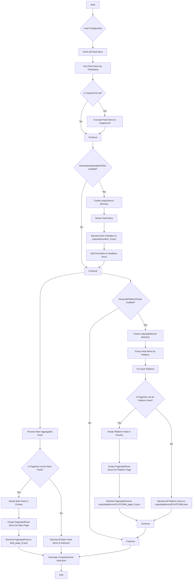

# Social Media Feed Aggregator - Specifications

This document outlines the specifications and usage of the Social Media Feed Aggregator, a Go-based tool designed to fetch social media posts from various platforms and compile them into a single, unified JSON file, published via GitHub Pages.

## Table of Contents
1.  [Project Overview](#project-overview)
2.  [Getting Started (For Users)](#getting-started-for-users)
    *   [Forking the Repository](#forking-the-repository)
    *   [Configuring `config.yaml`](#configuring-configyaml)
    *   [Setting Up GitHub Secrets](#setting-up-github-secrets)
    *   [Adjusting the Update Schedule](#adjusting-the-update-schedule)
3.  [Output JSON Schema](#output-json-schema)
4.  [Supported Feeds](#supported-feeds)
5.  [Adding New Feeds (For Developers)](#adding-new-feeds-for-developers)

---

## 1. Project Overview

The Social Media Feed Aggregator allows users to create a personalized, aggregated feed of their social media content. By forking this repository and configuring it, users can automatically fetch posts from selected platforms and have them published as a static `feed.json` file on their GitHub Pages. This enables easy consumption of their social media presence from a single, consistent endpoint.

## 2. Getting Started (For Users)

### Forking the Repository

To get started, fork this repository to your own GitHub account. This will create a copy of the project under your control, allowing you to customize it.

### Configuring `config.yaml`

After forking, you will need to create a `config.yaml` file in the `config/` directory. This file tells the aggregator which social media feeds to enable and provides any non-sensitive configuration, as well as global output settings.

A `config.yaml.example` file is provided for reference. Copy its content and modify it:

```bash
cp config/config.yaml.example config/config.yaml
```

Edit `config/config.yaml` to enable or disable feeds, provide specific configurations (e.g., RSS feed URLs), and adjust output settings.

Example `config.yaml`:

```yaml
# Global output settings
output_limit: 0 # Set to a positive integer to limit the total number of items in the output. 0 or negative means no limit.
page_size: 0    # Set to a positive integer to enable pagination. Each page will contain this many items. 0 or 1 means no pagination (single file output).
generate_individual_item_files: false # Set to true to generate a separate JSON file for each feed item.
generate_platform_feeds: false      # Set to true to generate separate JSON files for each social media platform.

feeds:
  linkedin:
    enabled: true
  threads:
    enabled: false # Set to true to enable Threads
  x:
    enabled: true
  instagram:
    enabled: false # Set to true to enable Instagram
  reddit:
    enabled: true
  rss:
    enabled: true
    urls:
      - "https://www.example.com/my-blog-feed.xml"
      - "https://www.another-site.com/news.rss"
```

### Setting Up GitHub Secrets

For platforms requiring authentication (LinkedIn, Threads, X, Instagram, Reddit), you must store your API keys and tokens as GitHub Secrets in your forked repository. This ensures sensitive information is not exposed in your public repository.

1.  Go to your forked repository on GitHub.
2.  Navigate to `Settings` > `Secrets and variables` > `Actions`.
3.  Click `New repository secret`.
4.  Create secrets with the following names (replace `YOUR_` with the actual platform name, e.g., `LINKEDIN_API_KEY`):
    *   `LINKEDIN_API_KEY`
    *   `LINKEDIN_API_SECRET`
    *   `THREADS_API_KEY`
    *   `THREADS_API_SECRET`
    *   `X_API_KEY`
    *   `X_API_SECRET`
    *   `INSTAGRAM_API_KEY`
    *   `INSTAGRAM_API_SECRET`
    *   `REDDIT_CLIENT_ID`
    *   `REDDIT_CLIENT_SECRET`
    *   `REDDIT_USERNAME`
    *   `REDDIT_PASSWORD`
    *   `STRAVA_CLIENT_ID`
    *   `STRAVA_CLIENT_SECRET`
    *   `GOODREADS_API_KEY`
    *   `GOODREADS_API_SECRET`
    *   `CREDLY_API_KEY`
    *   `CREDLY_API_SECRET`

    (Note: Specific API key/secret names might vary based on the actual API requirements. Refer to the respective platform's developer documentation for exact requirements.)

The Go application will read these secrets as environment variables during its execution within the GitHub Actions workflow.

### Adjusting the Update Schedule

The feed is automatically updated and published to GitHub Pages via a GitHub Actions workflow (`.github/workflows/build-and-publish.yml`). By default, this workflow runs daily at midnight UTC.

To change the update frequency:

1.  Go to your forked repository on GitHub.
2.  Navigate to `Actions`.
3.  Click on the `Build and Publish Feed` workflow.
4.  Click on the three dots (`...`) next to the workflow run and select `View workflow file`.
5.  Click the pencil icon to edit the file.
6.  Locate the `on: schedule:` section and modify the `cron` expression.

Example (to run every 6 hours):

```yaml
on:
  schedule:
    - cron: '0 */6 * * *' # Runs every 6 hours
```

Refer to the GitHub Actions documentation for cron syntax details.

## 3. Output JSON Schema

The aggregator can generate several types of JSON outputs based on configuration: a main aggregated feed, platform-specific feeds, and individual item files. A `meta.json` file provides an overview of all generated outputs.

### Main Aggregated Feed (`output/feed.json` or `output/feed_page_N.json`)

If `page_size` is 0 or 1, the main feed will be a single `feed.json` file containing an array of feed items. If `page_size` is greater than 1, the main feed will be paginated into `feed_page_1.json`, `feed_page_2.json`, etc.

**Paginated Feed Schema:**

```json
{
  "items": [
    {
      "platform": "string",         // The social media platform (e.g., "linkedin", "x", "rss")
      "post_content": "string",     // The main text content of the post
      "username": "string",         // The username or author of the post
      "media_url": "string | null", // URL to any associated media (image, video), or null if none
      "profile_link": "string",     // URL to the user's profile or source of the post
      "timestamp": "string",        // ISO 8601 formatted timestamp of the post (e.g., "2025-06-01T14:00:00Z")
      "interactions": "integer",    // A flat calculated number of interactions (likes, comments, etc.)
      "permalink": "string, optional" // URL to the individual item's JSON file, if generated
    },
    // ... more feed items ...
  ],
  "current_page": "integer",    // The current page number (1-indexed)
  "total_pages": "integer",     // The total number of pages
  "next_page": "string | null", // Filename of the next page, or null if this is the last page
  "prev_page": "string | null"  // Filename of the previous page, or null if this is the first page
}
```

### Platform-Specific Feeds (`output/platforms/PLATFORM.json` or `output/platforms/PLATFORM_page_N.json`)

If `generate_platform_feeds` is `true`, separate feeds will be generated for each enabled platform (e.g., `output/platforms/linkedin.json`, `output/platforms/x.json`). These can also be paginated if `page_size` is set, following the same `PaginatedFeed` schema as above.

### Individual Item Files (`output/items/item_<timestamp>_<index>.json`)

If `generate_individual_item_files` is `true`, each `FeedItem` will be written to its own JSON file within the `output/items/` directory. The `permalink` field in the main and platform feeds will point to these individual files.

**Individual Item Schema:**

```json
{
  "platform": "string",         // The social media platform (e.g., "linkedin", "x", "rss")
  "post_content": "string",     // The main text content of the post
  "username": "string",         // The username or author of the post
  "media_url": "string | null", // URL to any associated media (image, video), or null if none
  "profile_link": "string",     // URL to the user's profile or source of the post
  "timestamp": "string",        // ISO 8601 formatted timestamp of the post (e.g., "2025-06-01T14:00:00Z")
  "interactions": "integer",    // A flat calculated number of interactions (likes, comments, etc.)
  "permalink": "string, optional" // URL to the individual item's JSON file (self-referential)
}
```

### Metadata File (`output/meta.json`)

This file provides an overview of all generated feeds and their locations.

**Metadata Schema:**

```json
{
  "total_items": "integer",     // Total number of feed items processed
  "total_pages": "integer, optional", // Total pages for the main feed if paginated
  "main_feed_pages": [          // Array of paths to main feed pages (or single file)
    "string"
  ],
  "platform_feeds": {           // Map of platform names to their first page/single file path
    "platform_name": "string"
  },
  "individual_items_directory": "string, optional" // Path to the directory containing individual item files
}
```

### Data Generation Flow:



## 4. Supported Feeds

Currently, the aggregator supports fetching data from:

*   LinkedIn
*   Threads
*   X (formerly Twitter)
*   Instagram
*   Reddit
*   Strava
*   Goodreads
*   Credly
*   RSS Feeds

## 5. Adding New Feeds (For Developers)

To add support for a new social media platform:

1.  **Create a new package**: In the `feeds/` directory, create a new subdirectory for the platform (e.g., `feeds/newplatform/`).
2.  **Implement the `SocialFeed` interface**: Inside the new package, create a Go file (e.g., `newplatform.go`) and implement the `SocialFeed` interface defined in `feeds/feed.go`. This interface will require a `Fetch()` method.
3.  **Handle Authentication**: If the new platform requires API keys, ensure they are read from environment variables (which will be passed via GitHub Secrets).
4.  **Integrate into `main.go`**: Modify `main.go` to conditionally initialize and call the `Fetch()` method of your new feed based on the `config.yaml` settings.
5.  **Update Documentation**: Update this `README.md` and `config.yaml.example` to reflect the new supported platform.
